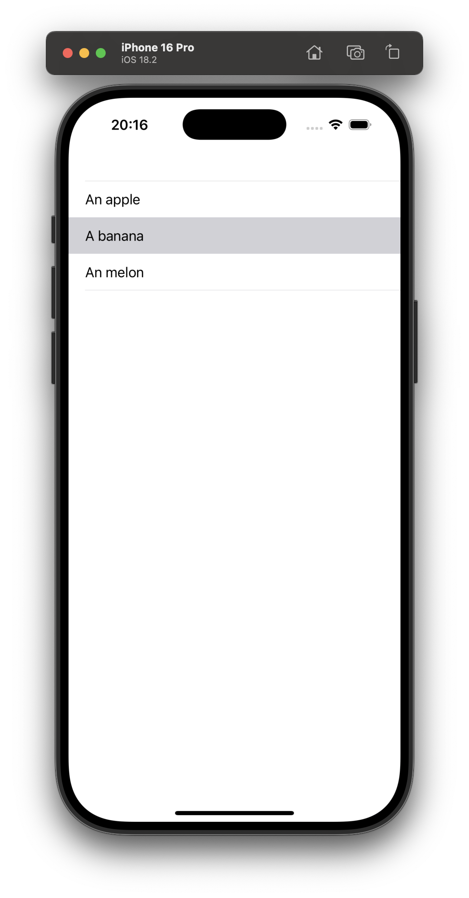
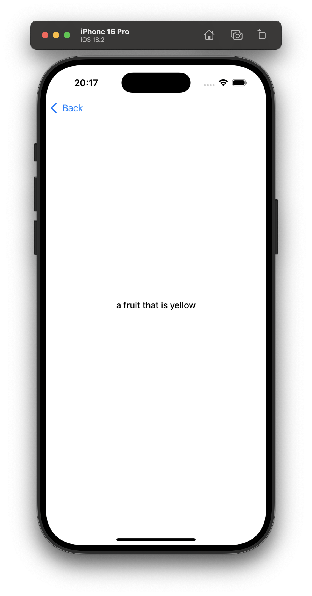

# Study Project 2: “Word Details” (Intermediate)

## Overview
This project extends the functionality of our simple word list app to **two screens**:
1. A **main list** of words (as before).
2. A **detail screen** showing more information about a selected word.

By doing so, we’ll learn how to:
- Use a **UINavigationController** set up programmatically (no Storyboard).
- Create and present **multiple view controllers**.
- Pass data (the selected word) from our list to the detail screen.

## Goals
- **Extend the List App** to have **two screens**: a main screen (`WordListViewController`) and a detail screen (`WordDetailViewController`).
- **Practice Navigation**: Use a `UINavigationController` in code to push the detail screen when a user taps on a table cell.
- **Separate `loadView()` overrides**: Each view controller sets up its UI programmatically, demonstrating the flexibility of code-only UIs.

Here’s a screenshot of the app running:

